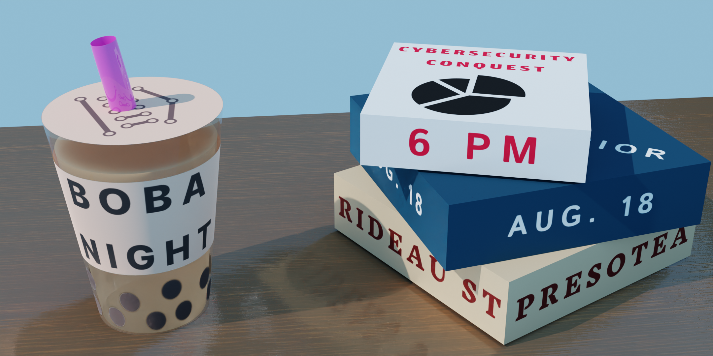
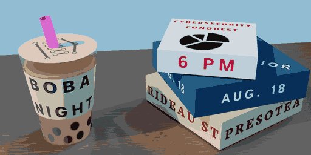
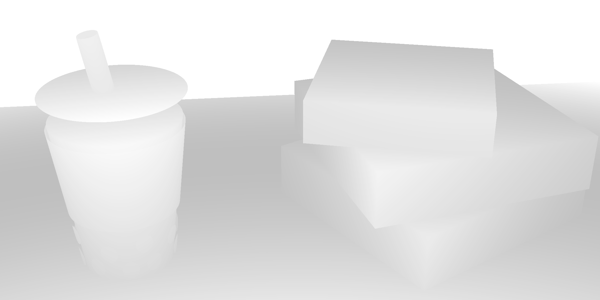
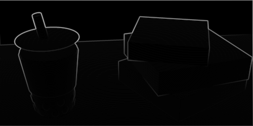
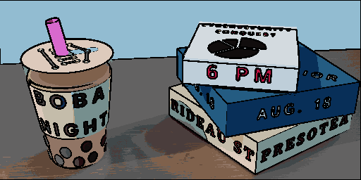
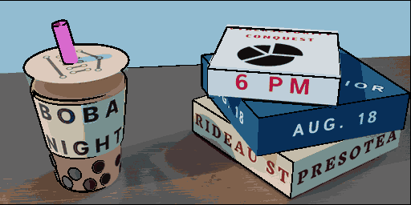

# art_boi: Advanced Toon Shading and Pixel Art Enhancement for 3D Renders

**Introducing art_boi – a cutting-edge post-processing tool designed to seamlessly integrate advanced toon shading and pixel art aesthetics into your 3D renders. Leveraging the dynamic lighting capabilities of EVEE, Blender's state-of-the-art render pipeline, art_boi transcends traditional boundaries to bring forth a realm of unmatched visual sophistication.**

## Purpose and Genesis

Rooted in the pursuit of technical excellence and unfettered creative exploration, art_boi arises as an embodiment of innovation. Engineered to harmoniously converge EVEE's intricate lighting simulation with the captivating essence of pixel art aesthetics, this avant-garde codebase redefines the possibilities of artistic transformation. Prepare to embark on a journey of pioneering technical prowess and imaginative ingenuity, with art_boi as your unwavering guide.

## The Transformative Process Demystified

1. **Rendition and Data Extraction:**
   - Export meticulously crafted 3D renders, encapsulating intricate design intricacies.
   - Extract critical data elements: depth map and normal map, foundational inputs that drive forthcoming transformations.

2. **Precision Downscaling:**
   - Execute precise downscaling operations across all image components, meticulously priming them for forthcoming metamorphosis.

3. **Chromatic Mapping Proficiency:**
   - Implement meticulous color mapping algorithms, seamlessly aligning rendered images with their closest chromatic counterparts, setting the stage for transformative algorithms.

4. **Sobel Operator Enigma:**
   - Enlist the enigmatic Sobel operator, meticulously applied to nearest color, depth, and normal maps, conjuring intricate outlines that bestow life upon your creations.

1. **Layered Image Fusion:**
   - Choreograph a symphony of algorithms using the Python Imaging Library (PIL) to seamlessly layer these intricate outlines, elevating the visual richness of your masterpiece.

1. **Artistic Customization (Optional):**
   - Unleash technical artistry by crafting bespoke layering methodologies and precise masks, particularly valuable for textual components, achieving both aesthetic finesse and visual clarity.

## The Path Forward: Evolution and Aspirations

As we ascend the threshold of art_boi's evolution, the horizon teems with the potential for innovation and refinement:

- **Automated Sobel Layering Filter:** Elevate operational efficiency through automated outline generation during the rendering phase, infusing pixel-level magic with seamless precision.
- **Normals as Sculptor's Aids:** Seamlessly integrate normal maps to accentuate facets gracefully engaged with the camera vector, heightening the perception of three-dimensionality.
- **Precision Paradigm Shift:** Evolve towards a strictly typed codebase, enhancing accessibility and comprehensibility to reach unparalleled technical clarity.
- **Multithreaded Symphony:** Optimize performance through robust multithreading, empowering art_boi to transmute entire animations with unparalleled speed.
- **Toolset Symphony:** Experience technological harmony with specialized Blender tools tailored to streamline render mapping, unlocking a realm of creative possibility.
- **Layers of Imagination:** Effortlessly traverse between distinct color palettes, broadening the emotional spectrum within your artwork with computational elegance.
- **Dithering Precision:** Bridge nostalgia and reality through dithering options, seamlessly intertwining pixel art aesthetics with lifelike intricacy.

Embrace a paradigm shift in 3D rendering. Embark on an odyssey of transformative technical innovation guided by art_boi. Elevate your creations into a domain where toon shading and pixel art seamlessly converge, as the boundless potential of technical prowess breathes life into your artistic vision. Welcome to the future – welcome to art_boi.
